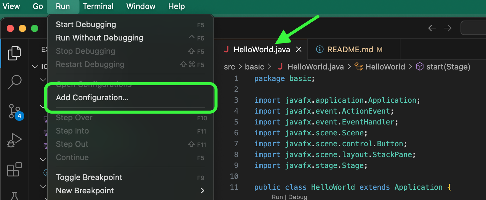

# JavaFX Installation Instructions

These instructions assume that you have a working development environment with Visual Studio Code, Java, and git. Before proceeding, you should have the following:

- Visual Studio Code [set up](https://code.visualstudio.com/docs/languages/java) with a Java Development Kit (JDK) and VS Code Java Coding Pack.
- Visual Studio Code set up with [GitHub](https://github.com/). Your local IDE should be able to clone, pull, push, and sync code to a remote repository.

If your local development environment meets the above criteria, you can proceed with the JavaFX install.

<br><br>

## 1. Determine Java or JDK version
First, verify the version of Java (or JDK) you have installed. You can do this by opening a terminal and running `java --version`. You should see something like the following:

```
java 23.0.1 2024-10-15
Java(TM) SE Runtime Environment (build 23.0.1+11-39)
Java HotSpot(TM) 64-Bit Server VM (build 23.0.1+11-39, mixed mode, sharing)
```

Here, we have Java Release 23 installed. Note this version number.

<br><br>

## 2. Download JavaFX
Go to the JavaFX website and [download](https://gluonhq.com/products/javafx/) the appropriate installer package for your version of Java. Select the appropriate operating system (macOS, Windows, Linux, etc.) and the appropriate processor architecture. Download the JavaFX **SDK** package

Typically, Windows machines will have `x64` architecture. macOS machines with an Intel processor will be `x64`, whereas Apple Silicon processors (e.g. M1, M2, etc.) will be `aarch64`.

<br><br>

## 3. Install JavaFX Libraries
Open the zip file you downloaded above. You should have a folder with a name similar to `javafx-sdk-23.0.1`. 

Place this folder where you keep the rest of your local repo folders. 

<br><br>

## 4. Install Visual Studio Code extensions
In Visual Studio Code, go to the Extensions panel. Search for and install the extension called `JavaFX Support`.


<br><br>

## 5. Configure libraries in Visual Studio Code
Open the example [`HelloWorld.java`](src/basic/HelloWorld.java) program in this repo. You should see the JavaFX imports underlined in red. We need to configure the location of these libraries.

In the bottom left corner of your IDE, click on `Java Projects` > `Referenced Libraries` > `Add...`


Navigate to the `lib/` folder within the JavaFX libraries folder from **Step 3**. Add the entire library folder, or individually add all `.jar` files within it. 

Your project should now be set up like this:


<br><br>

## 6. Configure runtime modules in Visual Studio Code
Though the build libraries have now been located, your `HelloWorld.java` will still give the following error on execution:

`Error: JavaFX runtime components are missing, and are required to run this application`

First, we need to get the path to the JavaFX library folder.

<br>

### 6a. Get the path to the JavaFX library folder (macOS)
From **Step 3** above, get the path to the `lib/` folder found in your JavaFX download. Right-click the folder while holding the Option key to **copy the folder path**:


Your macOS path should look something like:

```
/Users/davecheng/Documents/javafx-sdk-23.0.1/lib
```

<br>

### 6b. Get the path to the JavaFX library folder (Windows)
From **Step 3** above, get the path to the `lib/` folder found in your JavaFX download. Right-click the folder while holding the Option key to **copy the folder path**:


Your Windows path should look something like:

```
C:\Users\davecheng\My Documents\javafx-sdk-23.0.1\lib
```

For use in Visual Studio Code, you will need to rewrite this. Replace the Windows-only backslash `\` characters with the UNIX-compliant forward-slash `/`, like this:

```
C:/Users/davecheng/My Documents/javafx-sdk-23.0.1/lib
```


<br>

### Configure runtime modules
With the code editor open to `HellowWorld.java`, go to the menu bar and click on `Run` > `Add Configuration...`



You should now be looking at a configuration file `launch.json`. Find the section referencing `Current File` and add to this section. 

**NOTE: Append a `,` comma after the last parameter before pasting the parameter below.**

Copy this code and replace the path to `lib/` with your own, from the step above:

```
"vmArgs": "--module-path /Users/yourname/Documents/javafx-sdk-23.0.1/lib --add-modules javafx.controls,javafx.fxml"
```

Note that if your path has a space in it, you will need to **enclose the path** with **escaped quote** characters `\"` as follows:

```
"vmArgs": "--module-path \"/Users/yourname/My Documents/javafx-sdk-23.0.1/lib\" --add-modules javafx.controls,javafx.fxml"
```

The configured path should look like this:


Save and close the `launch.json` file.

<br><br>

## 7. Run your JavaFX program
Returning to `HelloWorld.java`, you will need to use a different method to run your code that loads the modules you just configured.

In Visual Studio Code, select the `Current File` configuration before running:


- Click on the **Run and Debug**"** icon in the left sidebar (or press `Ctrl+Shift+D` / `Cmd+Shift+D`)
- At the top of the debug panel, you'll see a dropdown menu with all your configurations.
- Select the `Current File` configuration you just set up.
- Use the green play button next to the dropdown to run with that configuration. 
- You can also use the `F5` keyboard shortcut to run.

NOTE: If you the run button in the top-right corner of the code editor window, you will invoke the configuration in `launch.json` for this specific file, which we have not defined. It is possible to edit `launch.json` to add the configuration for each individual file as well.

### "Hello, World!" in JavaFX

Your program should pop up a new window like this:


Clicking the button should output text to your console.

<br><br>

## 8. Explore other JavaFX examples
Explore the `src/com/jenkov/javafx` folder in this repo for examples of what you can do with JavaFX, sourced from [this repository](https://github.com/jjenkov/javafx-examples). 

### JavaFX Ensemble Viewer
[JavaFX Ensemble Viewer](https://www.jdeploy.com/~jdeploy-demo-javafx-ensemble) is a gallery of working examples that do not require you to compile and build individually. Click [here](https://www.jdeploy.com/~jdeploy-demo-javafx-ensemble) to download the installer for your operating system. Check out the interactive demo of all the things you can do with JavaFX.


### Learning from the Ensemble examples
All of the examples in Ensemble have a **View Source** link to see the corresponding code and documentation.


If the source files are missing in the Ensemble Viewer, you can find them online in [Ensemble's repository](https://github.com/shannah/javafx-ensemble8) under the path [/src/main/java/ensemble/samples](https://github.com/shannah/javafx-ensemble8/tree/master/src/main/java/ensemble/samples) and finding the appropriate category/application. You can also search the repo directly for the sample source code filename, which you can get from the Ensemble Viewer:


Documentation for these classes can also be found within the Ensemble viewer.

These instructions assume that you have a working development environment with Visual Studio Code, Java, and git. Before proceeding, you should have the following:

- Visual Studio Code [set up](https://code.visualstudio.com/docs/languages/java) with a Java Development Kit (JDK) and VS Code Java Coding Pack.
- Visual Studio Code set up with [GitHub](https://github.com/). Your local IDE should be able to clone, pull, push, and sync code to a remote repository.

If your local development environment meets the above criteria, you can proceed with the JavaFX install.

<br><br>

## 1. Determine Java or JDK version
First, verify the version of Java (or JDK) you have installed. You can do this by opening a terminal and running `java --version`. You should see something like the following:

```
java 23.0.1 2024-10-15
Java(TM) SE Runtime Environment (build 23.0.1+11-39)
Java HotSpot(TM) 64-Bit Server VM (build 23.0.1+11-39, mixed mode, sharing)
```

Here, we have Java Release 23 installed. Note this version number.

<br><br>

## 2. Download JavaFX
Go to the JavaFX website and [download](https://gluonhq.com/products/javafx/) the appropriate installer package for your version of Java. Select the appropriate operating system (macOS, Windows, Linux, etc.) and the appropriate processor architecture. Download the JavaFX **SDK** package

Typically, Windows machines will have `x64` architecture. macOS machines with an Intel processor will be `x64`, whereas Apple Silicon processors (e.g. M1, M2, etc.) will be `aarch64`.

<br><br>

## 3. Install JavaFX Libraries
Open the zip file you downloaded above. You should have a folder with a name similar to `javafx-sdk-23.0.1`. 

Place this folder where you keep the rest of your local repo folders. 

<br><br>

## 4. Install Visual Studio Code extensions
In Visual Studio Code, go to the Extensions panel. Search for and install the extension called `JavaFX Support`.


<br><br>

## 5. Configure libraries in Visual Studio Code
Open the example [`HelloWorld.java`](src/basic/HelloWorld.java) program in this repo. You should see the JavaFX imports underlined in red. We need to configure the location of these libraries.

In the bottom left corner of your IDE, click on `Java Projects` > `Referenced Libraries` > `Add...`


Navigate to the `lib/` folder within the JavaFX libraries folder from **Step 3**. Add the entire library folder, or individually add all `.jar` files within it. 

Your project should now be set up like this:


<br><br>

## 6. Configure runtime modules in Visual Studio Code
Though the build libraries have now been located, your `HelloWorld.java` will still give the following error on execution:

`Error: JavaFX runtime components are missing, and are required to run this application`

First, we need to get the path to the JavaFX library folder.

<br>

### 6a. Get the path to the JavaFX library folder (macOS)
From **Step 3** above, get the path to the `lib/` folder found in your JavaFX download. Right-click the folder while holding the Option key to **copy the folder path**:


Your macOS path should look something like:

```
/Users/davecheng/Documents/javafx-sdk-23.0.1/lib
```

<br>

### 6b. Get the path to the JavaFX library folder (Windows)
From **Step 3** above, get the path to the `lib/` folder found in your JavaFX download. Right-click the folder while holding the Option key to **copy the folder path**:


Your Windows path should look something like:

```
C:\Users\davecheng\My Documents\javafx-sdk-23.0.1\lib
```

For use in Visual Studio Code, you will need to rewrite this. Replace the Windows-only backslash `\` characters with the UNIX-compliant forward-slash `/`, like this:

```
C:/Users/davecheng/My Documents/javafx-sdk-23.0.1/lib
```


<br>

### Configure runtime modules
With the code editor open to `HellowWorld.java`, go to the menu bar and click on `Run` > `Add Configuration...`


You should now be looking at a configuration file `launch.json`. Find the section referencing `Current File` and add to this section. 

**NOTE: Append a `,` comma after the last parameter before pasting the parameter below.**

Copy this code and replace the path to `lib/` with your own, from the step above:

```
"vmArgs": "--module-path /Users/yourname/Documents/javafx-sdk-23.0.1/lib --add-modules javafx.controls,javafx.fxml"
```

Note that if your path has a space in it, you will need to **enclose the path** with **escaped quote** characters `\"` as follows:

```
"vmArgs": "--module-path \"/Users/yourname/My Documents/javafx-sdk-23.0.1/lib\" --add-modules javafx.controls,javafx.fxml"
```

The configured path should look like this:


Save and close the `launch.json` file.

<br><br>

## 7. Run your JavaFX program
Returning to `HelloWorld.java`, you will need to use a different method to run your code that loads the modules you just configured.

In Visual Studio Code, select the `Current File` configuration before running:


- Click on the **Run and Debug**"** icon in the left sidebar (or press `Ctrl+Shift+D` / `Cmd+Shift+D`)
- At the top of the debug panel, you'll see a dropdown menu with all your configurations.
- Select the `Current File` configuration you just set up.
- Use the green play button next to the dropdown to run with that configuration. 
- You can also use the `F5` keyboard shortcut to run.

NOTE: If you the run button in the top-right corner of the code editor window, you will invoke the configuration in `launch.json` for this specific file, which we have not defined. It is possible to edit `launch.json` to add the configuration for each individual file as well.

### "Hello, World!" in JavaFX

Your program should pop up a new window like this:


Clicking the button should output text to your console.

<br><br>

## 8. Explore other JavaFX examples
Explore the `src/com/jenkov/javafx` folder in this repo for examples of what you can do with JavaFX, sourced from [this repository](https://github.com/jjenkov/javafx-examples). 

### JavaFX Ensemble Viewer
[JavaFX Ensemble Viewer](https://www.jdeploy.com/~jdeploy-demo-javafx-ensemble) is a gallery of working examples that do not require you to compile and build individually. Click [here](https://www.jdeploy.com/~jdeploy-demo-javafx-ensemble) to download the installer for your operating system. Check out the interactive demo of all the things you can do with JavaFX.


<br><br>
